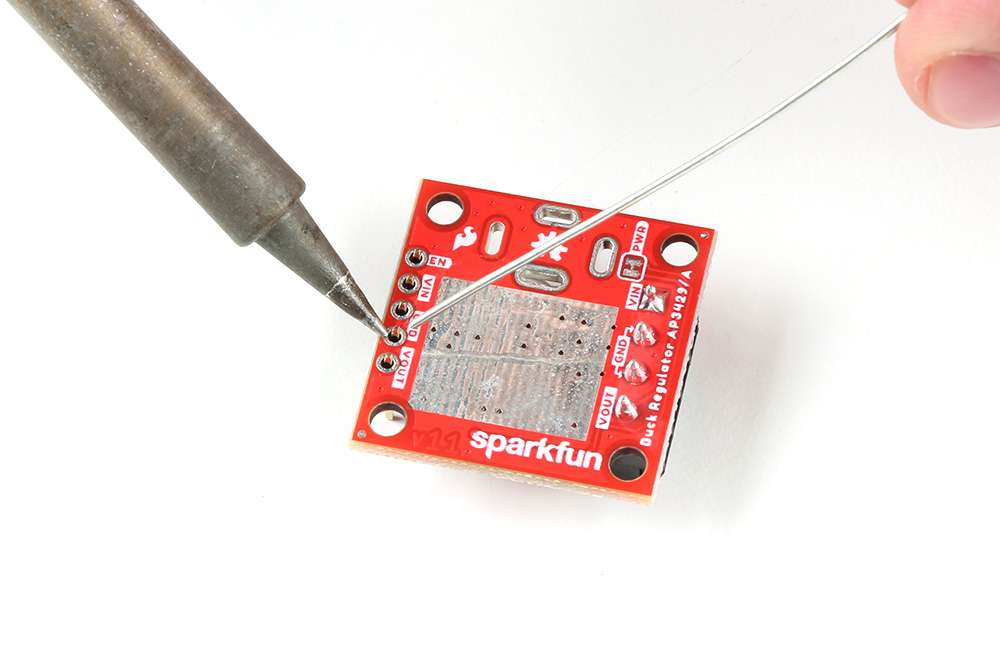
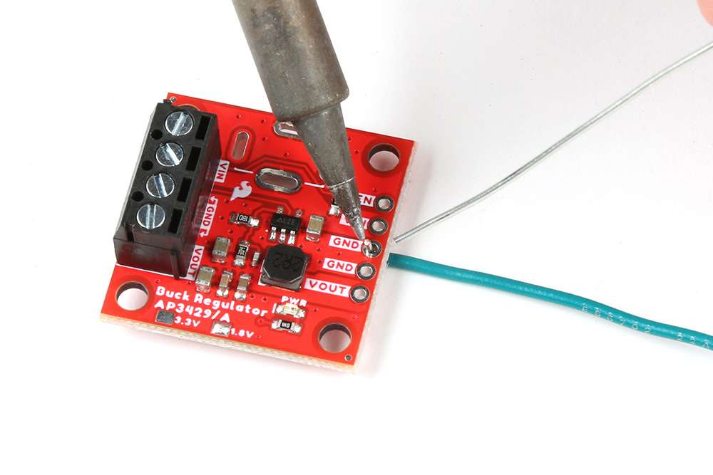
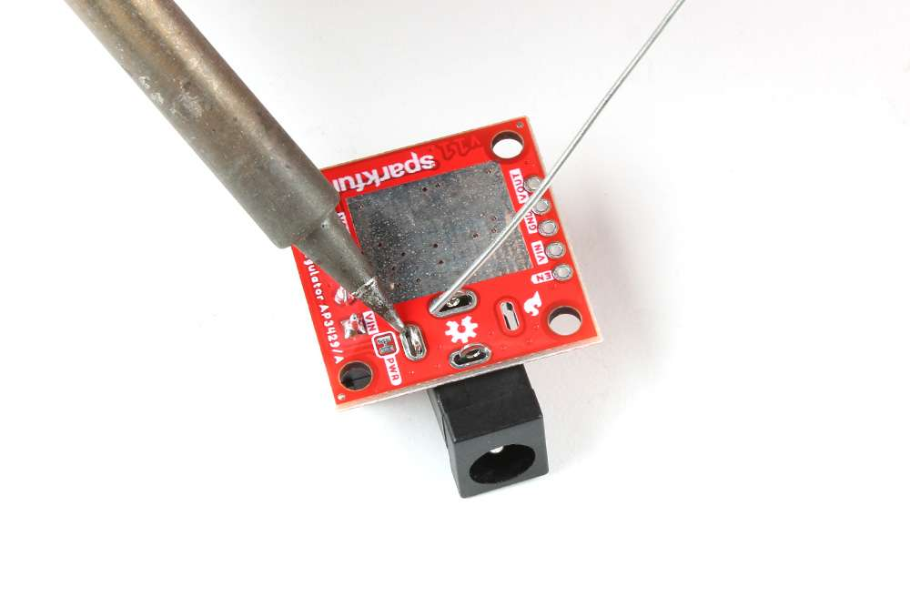
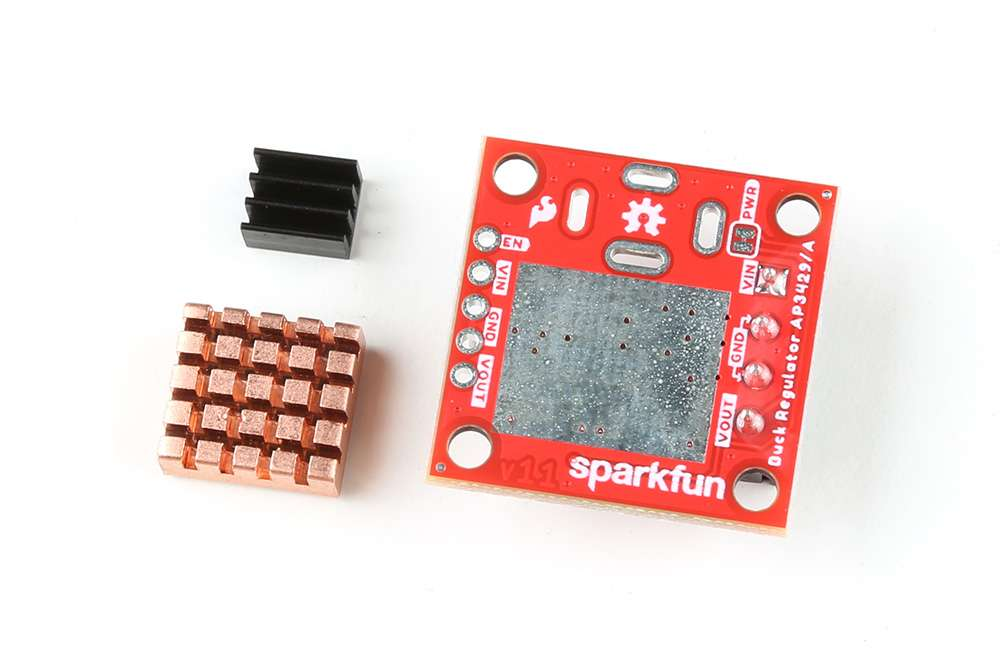

## :material-soldering-iron:&nbsp;Headers

??? note "New to soldering?"
	If you have never soldered before or need a quick refresher, check out our [How to Solder: Through-Hole Soldering](https://learn.sparkfun.com/tutorials/how-to-solder-through-hole-soldering) guide.
	

		<a href="https://learn.sparkfun.com/tutorials/5">How to Solder: Through-Hole Soldering 
		</a>
	

The pins for the SparkFun AP3429A Buck Regulator Breakout boards are broken out to 0.1"-spaced pins on the outer edges of the board. When selecting headers, be sure you are aware of the functionality and board orientation required.

<figure markdown>
[{ width="200" }](../img/hookup_guide/assembly-header.jpg "Click to enlarge")
<figcaption markdown>
Soldering headers to the AP3429A Buck Regulator Breakout boards.
</figcaption>
</figure>

??? tip "Jumper the Enable Pin"
	On the AP3429A Buck Regulator Breakout board, users can short the [`VIN`](../hardware_overview/#power "Input Voltage") and [`EN`](../hardware_overview/#power-control "Enable Pin") pins. This will allow users to bypass the undervoltage threshold and force the power output to be enabled.

## :material-soldering-iron:&nbsp;Hookup Wire
??? note "New to soldering?"
	If you have never soldered before or need a quick refresher, check out our [How to Solder: Through-Hole Soldering](https://learn.sparkfun.com/tutorials/how-to-solder-through-hole-soldering) guide.
	

		<a href="https://learn.sparkfun.com/tutorials/5">How to Solder: Through-Hole Soldering 
		</a>
	

Users can also solder their wire connections directly to the pins of the AP3429A Buck Regulator breakout boards. When planning out the connections, be sure you are aware of the functionality required.

!!! danger
	With higher current applications, users should ensure the wires can handle the current load. *(i.e. A 32AWG wire probably won't be able to handle 2A)*

<figure markdown>
[{ width="200" }](../img/hookup_guide/assembly-wire.jpg "Click to enlarge")
<figcaption markdown>
Soldering wires to the AP3429A Buck Regulator Breakout boards.
</figcaption>
</figure>

## :material-soldering-iron:&nbsp;Barrel Jack PTH
??? note "New to soldering?"
	If you have never soldered before or need a quick refresher, check out our [How to Solder: Through-Hole Soldering](https://learn.sparkfun.com/tutorials/how-to-solder-through-hole-soldering) guide.
	

		<a href="https://learn.sparkfun.com/tutorials/5">How to Solder: Through-Hole Soldering 
		</a>
	

A [barrel jack connector](https://www.sparkfun.com/products/119) can be added to the AP3429A Buck Regulator breakout boards. The plated through-hole slots allow the barrel jack connector to be oriented on the top or bottom of the board.

<table class="pdf">
	<tr>
		<td align="center">
			 
			<i>Soldering a [barrel jack connector](https://www.sparkfun.com/products/119) onto the top of the AP3429A Buck Regulator Breakout board.</i>
		</td>
		<td align="center">
			 
			<i>Soldering a [barrel jack connector](https://www.sparkfun.com/products/119) onto the bottom of the AP3429A Buck Regulator Breakout board.</i>
		</td>
	<tr>
</table>

-   <figure markdown>
	
	<figcaption markdown>
	Soldering a [barrel jack connector](https://www.sparkfun.com/products/119) onto the top of the AP3429A Buck Regulator Breakout board.
	</figcaption>
	</figure>

-   <figure markdown>
	
	<figcaption markdown>
	Soldering a [barrel jack connector](https://www.sparkfun.com/products/119) onto the bottom of the AP3429A Buck Regulator Breakout board.
	</figcaption>
	</figure>

## Screw Terminals
A screw terminal is a great non-permanent solution, to connect the board. To use the screw terminals, simply insert the correct wires into the screw terminal opening and tighten the screw with a small flathead screwdriver for a firm connection.

<figure markdown>
[{ width="200" }](../img/hookup_guide/assembly-screw_terminal.jpg "Click to enlarge")
<figcaption markdown>Connecting a wire to the AP3429A Buck Regulator Breakout Board's' screw terminal.</figcaption>
</figure>

## Heat Sink
!!! tip
    With larger heat sinks, we recommend a test fit and attaching it last to avoid conflicts with other parts of the board. For example, the heat sink could block the PTH pins/slots or access to the jumper pad.

To attach a [heat sink](https://www.sparkfun.com/products/18704) to the board, users will also need a piece of [thermal tape](https://www.sparkfun.com/products/17054). We recommend the following procedure:

1. Cut out a piece of [thermal tape](https://www.sparkfun.com/products/17054) to fit the bottom of the [heat sink](https://www.sparkfun.com/products/18704).
	
	!!! tip
		Covering the entire bottom of the heat sink can insulate the electrical contacts on the board from shorting.

    * For a perfect fit, users can place the heat sink over the tape and trace the outline to cut with scissors.
    * For a perfect fit, users can also place the heat sink over the tape and cut the outline with a [hobby knife](https://www.sparkfun.com/products/9200).

2. Place the piece of thermal tape on the bottom of the heat sink.

	!!! tip
		We recommend peeling off just one side of the backing sheet or [release liner](https://en.wikipedia.org/wiki/Release_liner) to place the thermal tape on the heat sink. Users can then peel the other side off when they are ready to place the heat sink on their board.
	
3. Attach the heat sink to the board.
    * Make sure to make any jumper modifications and/or solder any connections before placing the heat sink on the board.
    * Make sure to avoid any electrical contact with the sides of the heat sink.

<table class="pdf">
	<tr>
		<td align="center">
			 
			<i>Different <a href="https://www.sparkfun.com/categories/tags/heatsink">heat sinks</a> next to the AP3429A Buck Regulator Breakout board.</i>
		</td>
		<td align="center">
			 
			<i><a href="https://www.sparkfun.com/products/18704">Heat sink</a> attached to the AP3429A Buck Regulator Breakout board.</i>
		</td>
	<tr>
</table>

-   <figure markdown>
	
	<figcaption markdown>
	Different [heat sinks](https://www.sparkfun.com/categories/tags/heatsink) next to the AP3429A Buck Regulator Breakout board.
	</figcaption>
	</figure>

-   <figure markdown>
	
	<figcaption markdown>
	[Heat sink](https://www.sparkfun.com/products/18704) attached to the AP3429A Buck Regulator Breakout board.
	</figcaption>
	</figure>

