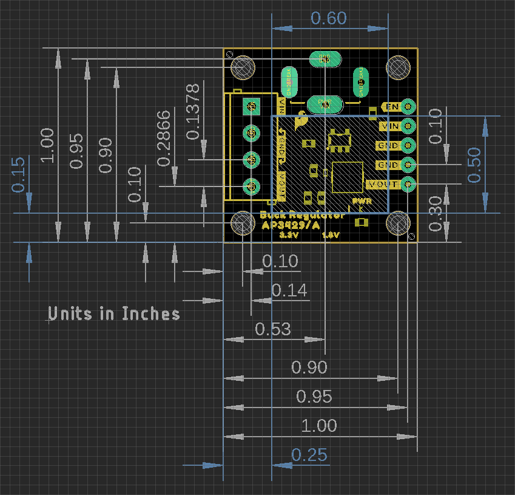
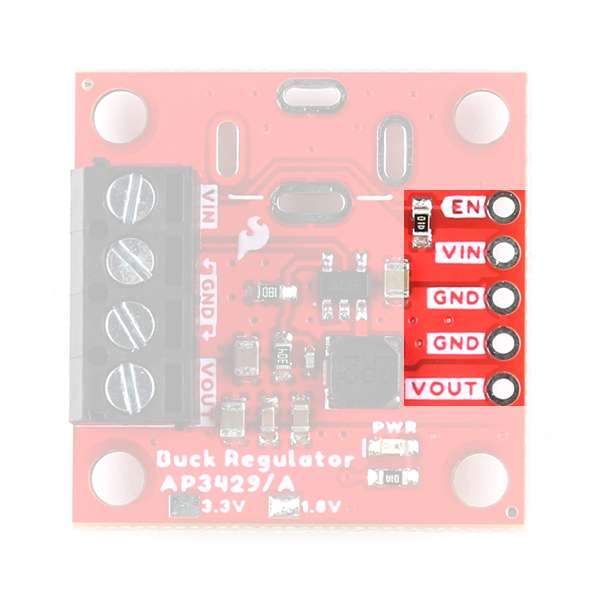
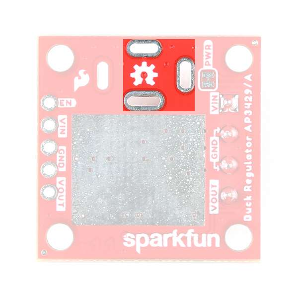
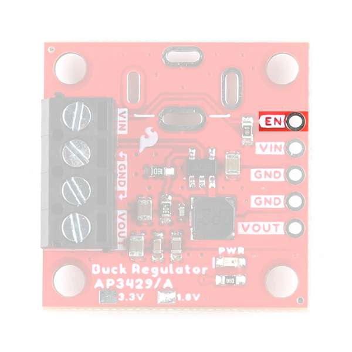
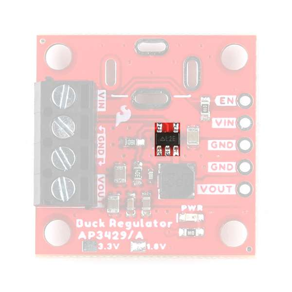
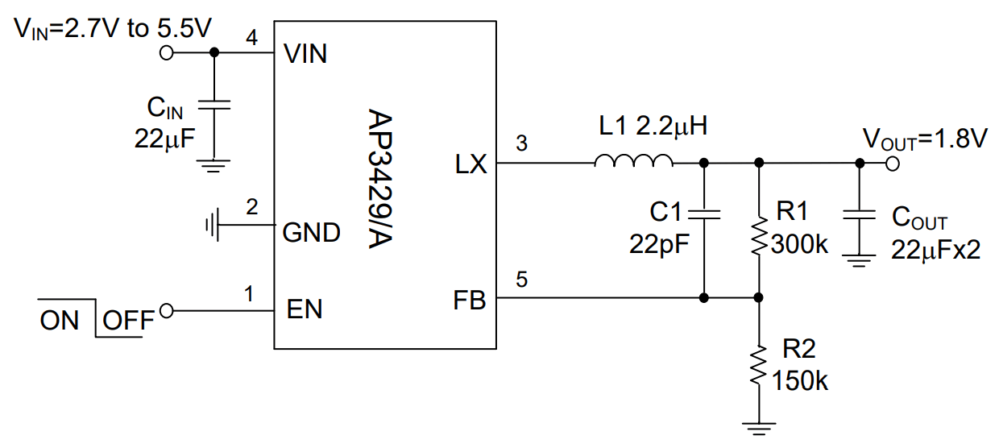
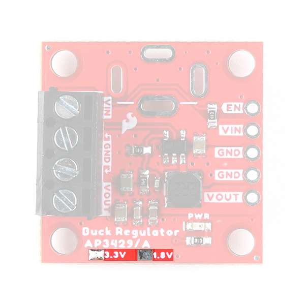
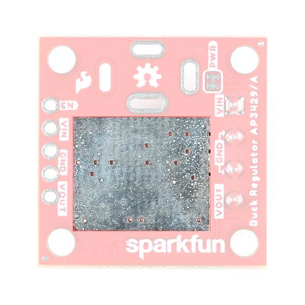
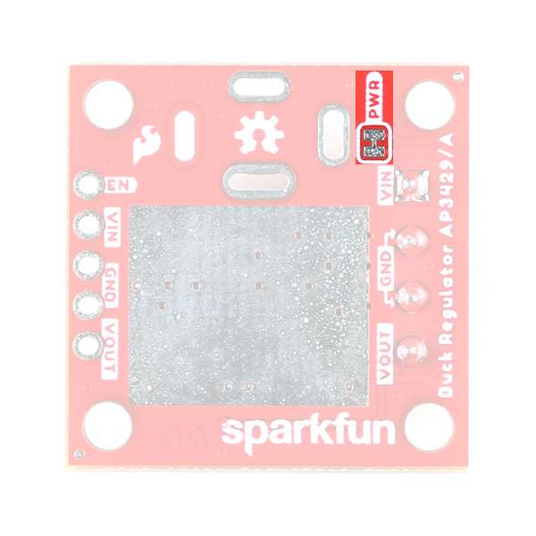

## 📐&nbsp;Board Dimensions

The board dimensions are illustrated in the drawing below; the listed measurements are in inches.

<figure markdown>
[{ width="400" }](../img/hookup_guide/dimensions.png "Click to enlarge")
<figcaption markdown>
[Board dimensions (PDF)](../board_files/dimensions.pdf) for the AP3429A Buck Regulator breakout boards, in inches.
</figcaption>
</figure>

??? tip "Need more measurements?"
	For more information about the board's dimensions, users can download the [eagle files](../board_files/eagle_files.zip) for the board. These files can be opened in Eagle and additional measurements can be made with the dimensions tool.

	??? info ":octicons-download-16:{ .heart } Eagle - Free Download!"
		Eagle is a [CAD]("computer-aided design") program for electronics that is free to use for hobbyists and students. However, it does require an account registration to utilize the software.

		

		[Download from :autodesk-primary:{ .autodesk }](https://www.autodesk.com/products/eagle/free-download "Go to downloads page"){ .md-button .md-button--primary width="250px" }
		

	
	??? info ":straight_ruler: Dimensions Tool"
		This video from Autodesk demonstrates how to utilize the dimensions tool in Eagle, to include additional measurements:

		

		

		<iframe src="https://www.youtube.com/embed/dZLNd1FtNB8" title="EAGLE Dimension Tool" frameborder="0" allow="accelerometer; autoplay; clipboard-write; encrypted-media; gyroscope; picture-in-picture" allowfullscreen></iframe>
		

		{ .qr }
		

## :material-lightning-bolt:&nbsp;Power

Users are provided with [PTH](https://en.wikipedia.org/wiki/Through-hole_technology "Plated Through Holes") to connect their external power supply, the output voltage from the board, and the [`EN`](#power-control "Enable") power control pin for the buck regulator. The AP3429A buck regulator has an input voltage range is **2.7V** to **5.5V**. Each board has a different regulated output voltage (**1.8V** or **3.3V**) and input voltage range. *(These are step-down DC/DC converters and cannot step-up or boost the voltage output.)*

-   <figure markdown>
	
	<figcaption markdown>
	The power connections on the AP3429A Buck Regulator Breakout boards.
	</figcaption>
	</figure>

Below, is a general summary of the circuitry on the board:

* **`VIN`** - Power supply input
    * 1.8V Buck Regulator: **2.7V to 5.5V**
    * 3.3V Buck Regulator: **3.9V to 5.5V**
* **`EN`** - Enables the power output of the board
	* Has an input voltage range up to **5.5V**
	* Must be pulled `HIGH` above **1.5V** to enable the power output. Otherwise, if pulled `LOW` below 0.4V, the device shuts down.
* **`VOUT`** - Regulated 1.8V or 3.3V output *(up to 2A)*
* **`GND`** - The common ground or the 0V reference for the board

!!! info
	For more details, users can reference the [schematic](../board_files/schematic.pdf) and the [datasheets of the individual components](../resources/#hardware-component-documentation) in the power circuitry.

??? tip "Maximum Load Current"
	While the IC is rated up to 2A, we were able to squeeze a little extra juice for a maximum load of ~2.2A. Anything near 2.4A, the board will start to struggle and automatically shut down.
	
	***Disclaimer:** We don't recommend that users expect to be able to load the boards with a maximum 2.2A, as we are not sure how this may affect the lifespan of the board. We just want users to know that they may have an extra margin of safety on their peak load.* 

??? tip "Quiescent Current Draw"
    Users should expect a maximum quiescent current draw of ~365&micro;A from the board. For a lower quiescent current, users can modify the board by removing the pull-up resistor on the [`EN`](#power-control "enable") pin.

	

	-	Measured Values

		---

		

		
		| Input Voltage (V) | I~q~ (&micro;A) | I~q~ - Power Enabled (&micro;A) |
		| :-: | :-: | :-: |
		| 6 | 65 | 196 |
		| 12 | 129 | 209 |
		| 24 | 260 | 290.5 |
		| 32 | 330 | 355 |

		

	-	Pull-Up Resistor Modification

		---

		<figure markdown>
		
		<figcaption markdown>
		Pull-up resistor on the AP3429A Buck Regulator Breakout boards.
		</figcaption>
		</figure>
		
		!!! danger
			Modifying a board to remove the pull-up resistor, requires advanced soldering skills. Users should **not** attempt this modification unless it is absolutely, necessary and they are confident in their skills because the board can be permanently damaged.

	

### :material-connection:&nbsp;Power Connections

There are several options available for users to connect power to and from their AP3429A buck regulator breakout board.

| Input Options  | Output Power | Enable Pin |
| :------------- | :----------- | :--------- |
| <ul><li>PTH Pins</li><li>Screw Terminal</li><li>Barrel Jack</li></ul> | <ul><li>PTH Pins</li><li>Screw Terminal</li></ul> | <ul><li>PTH Pins</li></ul> |

#### :material-soldering-iron:&nbsp;PTH Pins

Five [PTH](https://en.wikipedia.org/wiki/Through-hole_technology "Plated Through Holes") pins are provided for an external power supply, the output voltage from the board, and the [`EN`](#power-control "enable") power control pin. The holes are spaced 0.1", to be compatible with [headers](https://www.sparkfun.com/categories/381 "Click here for a full selection of our available headers") and [breadboards](https://www.sparkfun.com/categories/302 "Click here for a full selection of our available breadboards").

-   <figure markdown>
	
	<figcaption markdown>
	The PTH power pins on the AP3429A Buck Regulator Breakout boards.
	</figcaption>
	</figure>

#### :screwdriver:&nbsp;Screw Terminals

A screw terminal is provided for users, as a non-permanent solution, to easily connect wires to the board.

!!! info "Compatible Wire Sizes"
	The screw terminal is compatible with wire sizes from **26AWG** to **16AWG**.

<figure markdown>
[{ width="200" }](../img/hookup_guide/screw_terminal.jpg "Click to enlarge")
<figcaption markdown>The screw terminal on the AP3429A Buck Regulator Breakout boards.</figcaption>
</figure>

#### :material-audio-input-stereo-minijack:&nbsp;Barrel Jack

PTH *(slots)* are provided for users to add a [barrel jack connector](https://www.sparkfun.com/products/119) to the top or bottom of the board. This provides users with an alternative method to connect a power supply to their board.

!!! info "Barrel Jack Size"
	Our recommended [barrel jack connector](https://www.sparkfun.com/products/119) is a 5.5mm barrel jack.

<figure markdown>
[{ width="200" }](../img/hookup_guide/barrel_jack.jpg "Click to enlarge")

</figure>

<table class="pdf">
	<tr>
		<td align="center">
			 
			<i>The plated slots for a barrel jack connector on the top side of the AP3429A Buck Regulator Breakout boards.</i>
		</td>
		<td align="center">
			 
			<i>The plated slots for a barrel jack connector on the bottom side of the AP3429A Buck Regulator Breakout boards.</i>
		</td>
	<tr>
</table>

-   <figure markdown>
	
	<figcaption markdown>
    The plated slots for a barrel jack connector on the top side of the AP3429A Buck Regulator Breakout boards.
    </figcaption>
	</figure>

-   <figure markdown>
	
	<figcaption markdown>
	The plated slots for a barrel jack connector on the bottom side of the AP3429A Buck Regulator Breakout boards.
	</figcaption>
	</figure>

### :bulb:&nbsp;Power LED

The red, power (`PWR`) LED will light up when the switching power output is enabled. However, the LED can be disabled for low-power applications by cutting the [jumper](#jumper).

<figure markdown>
[{ width="200" }](../img/hookup_guide/LED_pwr.jpg "Click to enlarge")
<figcaption markdown>
The `PWR` status LED indicator for the AP3429A Buck Regulator Breakout boards.
</figcaption>
</figure>

### :material-power:&nbsp;Power Control

There is an enable pin (`EN`) to control the output voltage *(i.e. on/off)*, with a typical threshold voltage of **1.5V** and a range up to **5.5V**

* Users should pull the `EN` pin high *(above 1.5V)* to enable the switching power output and pull the pin low *(below 0.4V)* to disable it.
	* Users can connect the `EN` pin to `VIN` to override the [UVLO]("Undervoltage Lockout") threshold.

!!! tip "Default Configuration"
	On our boards, the `EN` pin is pulled `HIGH` and the power output from the board is enabled by default.

-   <figure markdown>
	
	<figcaption markdown>
	Enable pin on the AP3429A Buck Regulator Breakout boards.
	</figcaption>
	</figure>

## :fontawesome-solid-microchip:&nbsp;AP3429A

The [AP3429A](../component_documentation/AP3429A.pdf) from [Diodes Incorporated](https://www.diodes.com/), is a 2A DC-DC buck converter with a wide input voltage range of 2.7V to 5.5V. Under a no-load condition, the quiescent current is 90&micro;A; and when disabled, the device shutdown supply current is less than 1&micro;A.

<table class="pdf" markdown="1">
<tr markdown="1">
<td markdown="block">
Features:

* VIN: 2.7V to 5.5V
* VOUT: 0.6V to VIN
* 2A Continuous Output Current
* 90&micro;A No-Load Quiescent Current
* 1MHz Switching Frequency
* Protection Circuitry
    * Undervoltage Lockout (UVLO)
    * Input Overvoltage Protection
    * Over Current Protection
        * Cycle-by-Cycle Peak Current Limit
    * Thermal Shutdown

</td>
<td align="center">
 
<i>AP3429A chip on the AP3429A Buck Regulator Breakout boards.</i>
</td>
</tr>
</table>

-   Features:

    * VIN: 2.7V to 5.5V
    * VOUT: 0.6V to VIN
    * 2A Continuous Output Current
    * 90&micro;A No-Load Quiescent Current
    * 1MHz Switching Frequency
    * Protection Circuitry
        * Undervoltage Lockout (UVLO)
        * Input Overvoltage Protection
        * Over Current Protection
            * Cycle-by-Cycle Peak Current Limit
        * Thermal Shutdown

-	<figure markdown>
	
	<figcaption markdown>
	AP3429A chip on the AP3429A Buck Regulator Breakout boards.
	</figcaption>
	</figure>

!!! info
	For more details, please refer to the [AP3429A datasheet](../component_documentation/AP3429A.pdf) and [application note](../component_documentation/AN_AP3428.pdf).

??? tip "Power Efficiency"
	Users should expect a power efficiency close to the chart presented in the [datasheet](../component_documentation/AP3429A.pdf) *(i.e. ~80% with smaller loads and up to +90% with larger loads)*. It should be noted that the efficiency varies with the load current and cooling.

	<figure markdown>
	[{ width=400 }](../img/hookup_guide/AP3429A-efficiency.png "Click to enlarge")
	<figcaption markdown>
	Figure from the [datasheet](../component_documentation/AP3429A.pdf).
	</figcaption>
	</figure>

??? info "Circuit Protection"
	The AP3429A features the following circuit protections:

	=== "Undervoltage Lockout"
		We have found the undervoltage lockout to trigger ~2.7V for the 1.8V breakout and ~3.9V for the 3.3V breakout board.
	
	=== "Over Current Protection"
		
		* If the peak current is higher than the current limit threshold, it will enter cycle-by-cycle current limit mode.
		* If short is detected, when the feedback voltage (V~FB~) drops under 0.3V, the AP3429 will turn off power output until the `VIN` or `EN` is cycled again to release it.
			* Once V~FB~ rises over 0.3V, the AP3429A automatically recovers to normal operation.
	
	=== "Over Voltage Protection"
		* **Output:** When `VOUT` exceeds 120% of the regulation level, the output power will be disabled until `VIN` or `EN` is cycled.
		* **Input:** When the input voltage is near 6.25V, the IC will shut down until the input voltage drops back down below 6V.

### Output Voltage Configuration

The output voltage from the AP3429A, is determined by the voltage divider on the feedback loop, as discussed in the [application note](../component_documentation/AN_AP3428.pdf).

??? tip "Application Note"
	While the [application note](../component_documentation/AN_AP3428.pdf) only lists the AP3428 buck converter, Diodes Incorporated has assured us that it is still applicable to the AP3429A.

$$
V_{OUT} =  0.6 * \frac{ (R_1 + R_2) }{ R_2 }
$$

Where, R~1~ and R~2~ are the resistors in the feedback loop:

<figure markdown>
[{ width="300" }](../img/hookup_guide/AP3429A-circuit.png "Click to enlarge")
<figcaption markdown>
Example circuit for the AP3429A.
</figcaption>
</figure>

## :material-selection-multiple-marker:&nbsp;Output Voltage Indicator

Since it would be difficult to differentiate the voltage output based on the small SMD parts, we provide a simple indicator for the configured output voltage of each board.

<table class="pdf">
	<tr>
		<td align="center">
			 
			<i>The output voltage indicator for the <b>3.3V</b> Buck Regulator Breakout.</i>
		</td>
		<td align="center">
			 
			<i>The output voltage indicator for the <b>1.8V</b> Buck Regulator Breakout.</i>
		</td>
	<tr>
</table>

-   <figure markdown>
	
	<figcaption markdown>
    The output voltage indicator for the **3.3V** Buck Regulator Breakout.
    </figcaption>
	</figure>

-   <figure markdown>
	
	<figcaption markdown>
	The output voltage indicator for the **1.8V** Buck Regulator Breakout.
	</figcaption>
	</figure>

## :hotsprings:&nbsp;Heat Sink Pad

A 0.5" x 0.6" platted copper pad is provided on the back of the boards, where users can add a heat sink to dissipate excess heat generated by the AP3429A. The pad can accommodate the [copper heatsink](https://www.sparkfun.com/products/18704) in our catalog.

??? info "Thermal Shutdown Temperature"
	The AP329A has a 160&deg;C (320&deg;F) thermal shutdown temperature. The AP3429A will restart automatically when the junction temperature decreases to +130°C.

<figure markdown>
[{ width="200" }](../img/hookup_guide/heat_sink.jpg "Click to enlarge")
<figcaption markdown>
Heat sink pad on the back of the AP3429A Buck Regulator Breakout boards.
</figcaption>
</figure>

## :material-selection-multiple-marker:&nbsp;Jumper

??? note "Never modified a jumper before?"
	Check out our <a href="https://learn.sparkfun.com/tutorials/664">Jumper Pads and PCB Traces tutorial</a> for a quick introduction!
	

		<a href="https://learn.sparkfun.com/tutorials/664">How to Work with Jumper Pads and PCB Traces 
		</a>
	

There is a jumper on the back of the board that can be used to easily modify a hardware connection on the board.

* **PWR** - This jumper can be used to remove power to the `PWR` LED.

<figure markdown>
[{ width="200" }](../img/hookup_guide/jumper.jpg "Click to enlarge")
<figcaption markdown>
The LED jumper on the back of the AP3429A Buck Regulator Breakout boards.
</figcaption>
</figure>
