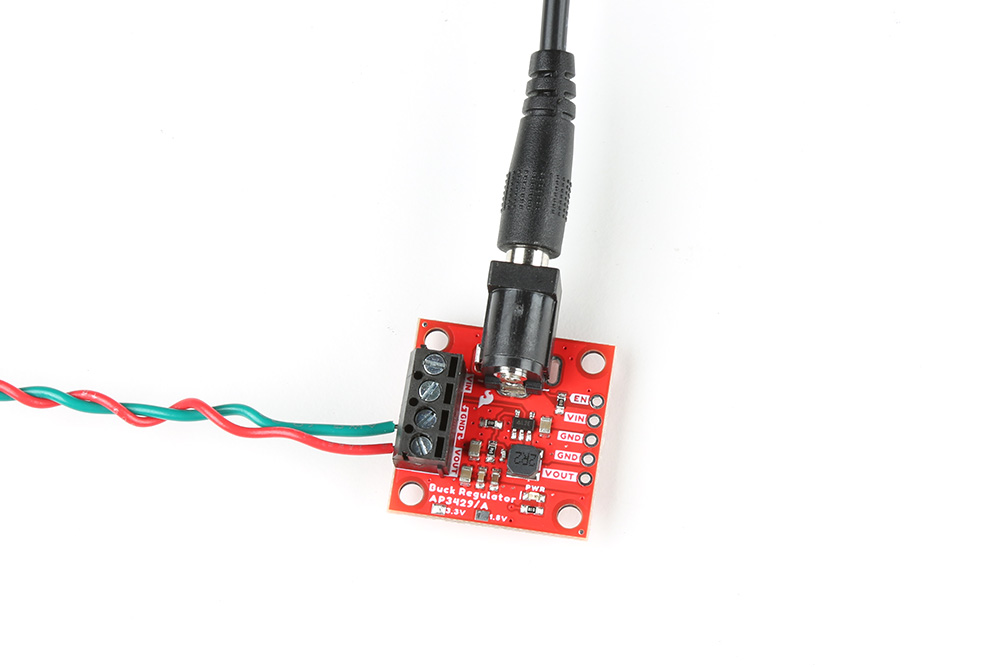
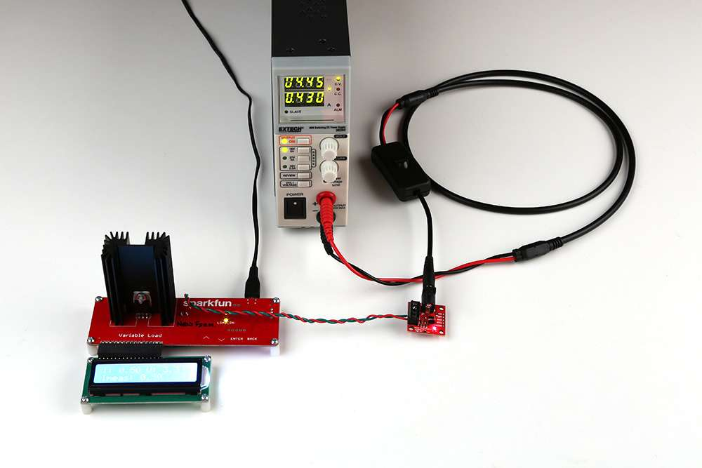

For users who would like to test their buck regulators, this page demonstrates a simple load test.

!!! note
	Users who wish to test the maximum parameters of their board should consider using a professional/benchtop DC electric load tester, instead of the [variable load kit](https://www.sparkfun.com/products/14449). 

## Required Hardware
To test the buck regulator boards, users will need the following hardware:

* DC Electric Load Tester
	* We are using the [SparkFun Variable Load Kit](https://www.sparkfun.com/products/14449)
* Power Supply
    * Use a benchtop-style power supply where you can configure the output voltage and see the current draw when loaded.
	* We are using the [80W DC Power Supply](https://www.sparkfun.com/products/retired/9291) *(retired product)*

<table class="pdf">
	<tr>
		<td>
			<a href="https://www.sparkfun.com/products/retired/9291">
				

				

				<h3 class="title">Power Supply - 80W DC Switching Mode</h3>
			</a>
			TOL-09291
		</td>
		<td>
			<a href="https://www.sparkfun.com/products/14449">
				

				

				<h3 class="title">SparkFun Variable Load Kit</h3>
			</a>
			KIT-14449
		</td>
    </tr>
</table>

-   <a href="https://www.sparkfun.com/products/retired/9291">**Power Supply - 80W DC Switching Mode** 
	TOL-09291

	---

	<figure markdown>
	
	</figure></a>

-   <a href="https://www.sparkfun.com/products/14449">**SparkFun Variable Load Kit** 
	KIT-14449

	---

	<figure markdown>
	
	</figure>
	</a>

## Hardware Setup
For this test, the hardware was setup up as follows:

* Power was supplied to the buck regulator through the soldered barrel jack.
* The output power from the buck regulator was connected to the variable load kit, through the screw terminal.
* No heat sink was attached to the buck regulator.

<figure markdown>
[{ width="400" }](../img/hookup_guide/test_setup.jpg "Click to enlarge") 
<figcaption markdown>Setup for a basic load test on the AP3429A Buck Regulator Breakout boards.</figcaption>
</figure>

## Test
To perform the test, the power supply was set to provide 4.5V at up to 4A. Meanwhile, the SparkFun variable load kit was configured to draw 0.5A.

<figure markdown>
[{ width="400" }](../img/hookup_guide/load_test.jpg "Click to enlarge") 
<figcaption markdown>A load test being performed on the AP3429A Buck Regulator Breakout board.</figcaption>
</figure>

Although it is a little hard to see in the picture, the power supply is providing 4.45V with a 430mA current draw to the buck regulator. The variable load kit is drawing 0.49A with the 3.34V output voltage from the buck regulator.
